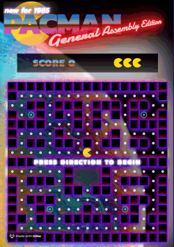
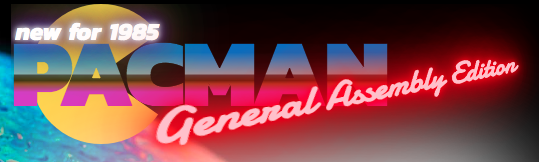

# Pacman 


**My take on the classic pacman arcade game.**

This was a solo project so all the work you see documented here is my own. The [first version](#v1.0) of this app was created in one week. I have been working on a version 2 on an ad-hoc basis, but this is still in progress.



## Built With

* Vanilla JavaScript
* CSS3

## Key Functionality
1. Ghost intelligence
    - Ghost movement modes (normal and obstacle navigation mode)
    - Ghost target switching. They switch between the ghost's home area and Pacman
    - Ghost "bias inversion". When Pacman eats a big pill, the ghosts usual bias towards Pacman is inverted so they flee away from him
    - Movement choice heirachy 
    - Movement history. The ghosts are awre of the path they have recently taken, and will choose to avoid doubling back on themselves, unless it is in their best interest
2. Level builder
    - In version one this was limited to clicking squares to toggle them between being a wall and being a space. These walls could then be 'built' by running a function in the console to extract the walls as an array, and paste it back into the js code
    - In version two this will be converted into a full mode where the level can be saved and chosen at the start of the game
3. CSS animation
    - All the seamless movement seen the game is controlled by CSS animation. The only gifs used are those of the ghosts to simplify the code required
4. Code Reusability
    - I went to great lengths to make sure I never coded the same thing twice. This led me to create five main components as js classes: Pacman, Ghost, Game control, Scoreboard, Player messaging
    - As soon as the classes are instantiated, they operate independently and contain their own data requred to function. For more detail, see the [overview](#Overview) section

## Future Improvements

With future [versions](#versioning), I intend to add the following functionality:

* Real level progression 
* Better touch control for mobile view
* Personalised ghost navigation


## Overview

I wanted to give the game a lovely 80's nostalgia feel, so I maxed out the neon and metallic styling. Using shadowing and linear gradients, I was able to produce that retro experience:



### The grid

The game is drawn from an array of squares which are represented on screen in a grid with a fixed width of 17 squares. The grid is dynamically drawn from a set of arrays which represent the level data:

```
levelData = [
  //Level 0 - This is a medium difficulty level
  { name: 'level0',
    prison: [160, 161, 162, 177, 178, 179],
    bigPills: [53, 65, 225, 233],
    walls: [0, 1, 2, 3, 4, 5, 6, 7, 8, 9, 10, 11, 12, 13, 14, 15, 16, 17, 33, 36, 37, 39, 40, 41, 43, 44, 45, 47, 48, 51, ..., 286, 287, 288]
  }
]
```

This allows the future capability to have a level editor, and level progression and save the in a database / locally.

All of the game logic is managed through toggling classes to the grid squares. The different classes are:
* wall
* pill
* big-pill
* prison
* pacman, and pacman-left, pacman-right, pacman-up, pacman-down, pacman-dead
* binky, pinky, stinky, clyde (I renamed them!) and their -up -down -left -right and -pilled modifiers

With adding then removing the classes, the CSS animations can be rendered so that when a class is applied, a 'sprite' can be represented as moving from one square to another. See the following example of Pacman.

Pacman's main class to describe him when he is stationary. He is actually made from a rounded square, with a clip path for his mouth:
```
.pacman:after{
  content: '';
  position: relative;
  width: 100%;
  height: 100%;
  border-radius: 50%;
  background-color: #ffd915;
  clip-path: polygon(100% 15%, 50% 50%, 100% 85%, 100% 100%, 0% 100%, 0% 0%, 100% 0%);
  z-index: 2;
}
```

The animation is applied as a 0.5 second transform as soon as the class is applied to the square:
```
div.grid-item.pacman-right:after {
  transform: rotate(0deg);
  animation: 0.5s linear slideRight;
}
```

And to make him munch as he moves, the clip path is also part of the movement animation:
```
@keyframes slideRight {
  0% {  transform: translateX(-100%) rotate(0deg);
        clip-path: polygon(100% 15%, 50% 50%, 100% 85%, 100% 100%, 0% 100%, 0% 0%, 100% 0%);}
  50%{  clip-path: polygon(100% 50%, 50% 50%, 100% 50%, 100% 100%, 0% 100%, 0% 0%, 100% 0%);}
  100%{ transform: translateX(0) rotate(0deg);
        clip-path: polygon(100% 15%, 50% 50%, 100% 85%, 100% 100%, 0% 100%, 0% 0%, 100% 0%);}
}
```


### Ghosts 

The ghosts were the most difficult challenge. They needed enough intelligence so they didnt get stuck in corners, and so they could still chase pacman if he moved erratically or hid behind a wall.


I didnt want to be influenced by how other people had solved this problem, so I avoided googling, but I had already researched the ghosts personalities. Once I realised that the ghosts all behaved differently, that was enough for me to begin the challenge. I approached it by giving the ghosts independence, creating a ghost class where each would operate completely independently on the grid. At a basic level, the ghosts have a heirachy of moves available to them, but the complexity is built up over how they decide which option to take:

1. Work out which directions I can move in from where I am
2. Understand where my target is (Pacman, one of the four corners, out of the centre 'prison')
3. Understand if I should be navigating towards, or away from my target (eg. Pacman ate a big pill)
4. Understand if I should be navigating around an obstacle (eg. a wall is between the ghost and pacman), if I am, I should navigate anticlockwise around the obstacle 
5. If i'm at a junction (two or more moves which arent backwards), choose the direction which leads to pacman
6. I'm not at a junction, so continue in the same direction if possible
7. If the only appropriate choice is away from pacman, go into obstacle mode
8. I dont have any choices and dont want to stand still, so make a random choice

The game will detect at the end of each move whether the ghost is about to occupy the same square as Pacman, and will trigger the life lost logic if it is. See the [game section](#game) for more detail about game turn logic.

The ghost is moved by toggling the class off from the current square and toggling it on to the new square, and this is done within the GameDefinition class. See below.

### Pacman


Pacman has some complex animation, but his logic is simple. He is controlled either by direction arrows or the touch input. On each game turn, his Player class decides where he can move, and if he died. The proessing of a direction key will keep pacman moving in that direction for each turn until he hits a wall, dies or another direction is chosen.

Like the ghost sprite movement, the pacman sprite movement for each turn is controlled through the GameDefinition class below.

### Game

The GameDefinition class governs the running of the game and victory conditions. The class is broken down into several methods which when orchestrated will run the game and control some of the game logic. This is broken down as follows:

Method|Use
---|---
paintGrid() | Used to create the level grid structure
paintDecoration() | Decorates the grid with the walls, prison and pills
startRound() | Starts the countdown, and repositions the sprites
initiateWin() | Controls what happens when the player wins
initiateLoss() | Controls what happens when the player loses
startMovement() | Unfreezes the sprites
stopMovement() | Freezes the sprites
addSprite() | Adds a sprite to a square and includes the direction variants
removeSprite() | Removes the specified sprite from that square
eachMove() | Is run for each game 'turn' - pacman and the ghosts are moved, the clock advanced, and will  decide if pacman won or died that turn and trigger either victory or loss. Finally, a decision is made about what target mode all the ghosts should operate in
switchGhostTargets() | This improves the game experience so the ghosts switch from targetting pacman to spreading out across the grid
pillEaten() | Controls the score logic if pacman eats a pill
bigPillEaten() | Controls the score logic if pacman eats a big pill, and triggers the ghosts to flee 
  
---

## Getting a local copy

There are no steps to folow to get this game working locally, it should just run out of the box with no packages or add-ons required.


## Versioning

#### v1.0
One week project, ended with a demo and presentation. MVP was complete and styled. Ghost inteligence was working well and the game was a challenge.

#### v2.0 - _still in development_
* Game grid responsive scaling for mobile view
* Touch input for mobile view
* Improved animations and simplified CSS code


## Acknowledgments

* I was inspired by the original game and this project is a tribute to its complexity and beauty
* I started this project at General Assembly - for their support - thanks!